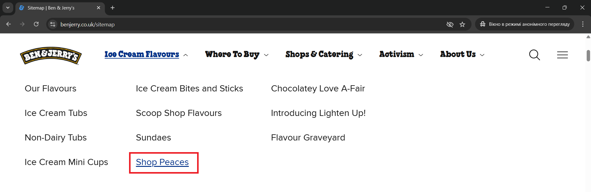
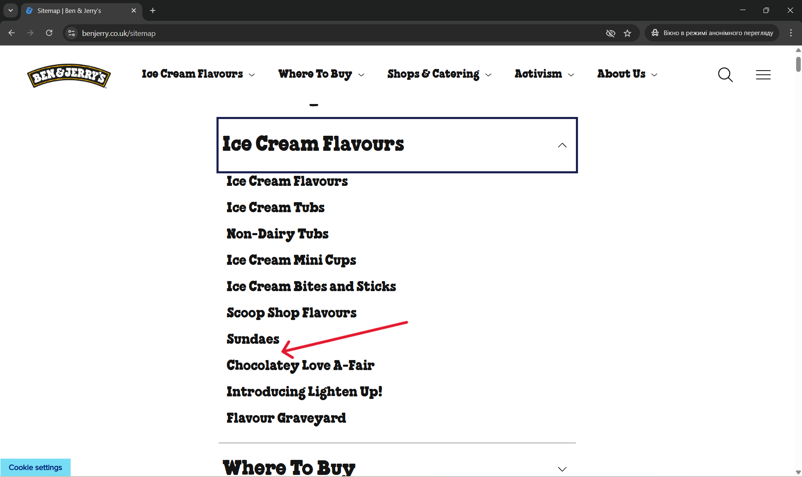

# Bug 001 — Sitemap: Ice Cream Flavours — Missing Subtitle “Shop Peaces”

---

## Bug Summary
**Category:** Other  
**Severity:** Medium  
**Occurrence:** Always (can be reproduced at all times)  
**Environment:** Windows 11, Chrome  
**Created on:** Tuesday, April 15, 2025 at 1:08 PM  

---

## Steps to Reproduce
1. Open the [Ben & Jerry’s homepage](https://www.benjerry.co.uk/).  
2. Scroll to the bottom of the page and click **Sitemap**.  
3. On the Sitemap page, click **Ice Cream Flavours**.  
4. In the top navigation menu, open **Ice Cream Flavours** again.  
5. Compare the quantity and names of subtitles in both sections.

---

## Expected Result
The list of subtitles for **Ice Cream Flavours** should be identical in both the **Navigation Menu** and the **Sitemap** section.

---

## Actual Result
On the **Sitemap**, the **“Shop Peaces”** subtitle is missing from the **Ice Cream Flavours** section.

---

## Attachments
- **Screenshots:** 

---
##  Notes
This report is part of non-commercial exploratory testing conducted for educational and portfolio purposes.  