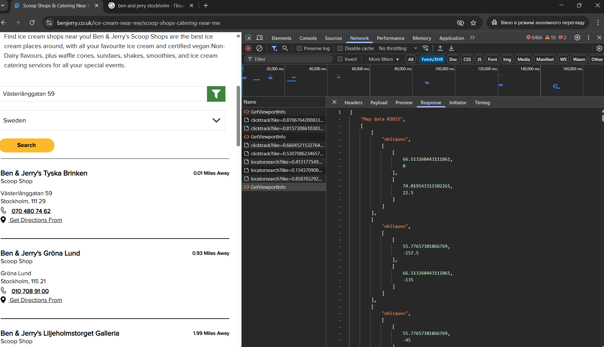

# Bug 002 — Where to buy: Scoop Shops & Catering Near Me - map data doesn't fetch for some countries, f.e. Sweden

---

## Bug Summary
**Category:** Malfunction  
**Severity:** High  
**Occurrence:** Always (can be reproduced at all times)  
**Environment:** Windows 11, Chrome  
**Created on:** Tuesday, April 15, 2025 at 3:07 PM

---

## Steps to Reproduce
1. The user clicks on **Where to buy** in the **Navigation panel** ( top of the home page)
2. The user selected **Shops & Catering Near Me**
3. The user selected Denmark from the dropdown list
4. The user click on Search button
5. The user selected France from the dropdown list
6. The user click on Search button
7. The user selected Sweden from the dropdown list
8. The user click on Search button

---

## Expected Result
The user is able to see all Ben&Jerry addresses in the Sweden

---

## Actual Result
1. The user still sees the map of France, data about Swedish shops doesn't found, missing POST request for action GetViewPortInfo
2. Need to use walkaround way - to specify the address (see screencast)rom the **Ice Cream Flavours** section.

---

## Attachments
- **Screenshots:**

- **Screencast:**  
[ Watch Video Here](https://github.com/OlhaZ-dev/ben-jerry-testing/issues/3#issue-3603699070)

---

##  Notes
This report is part of non-commercial exploratory testing conducted for educational and portfolio purposes.  