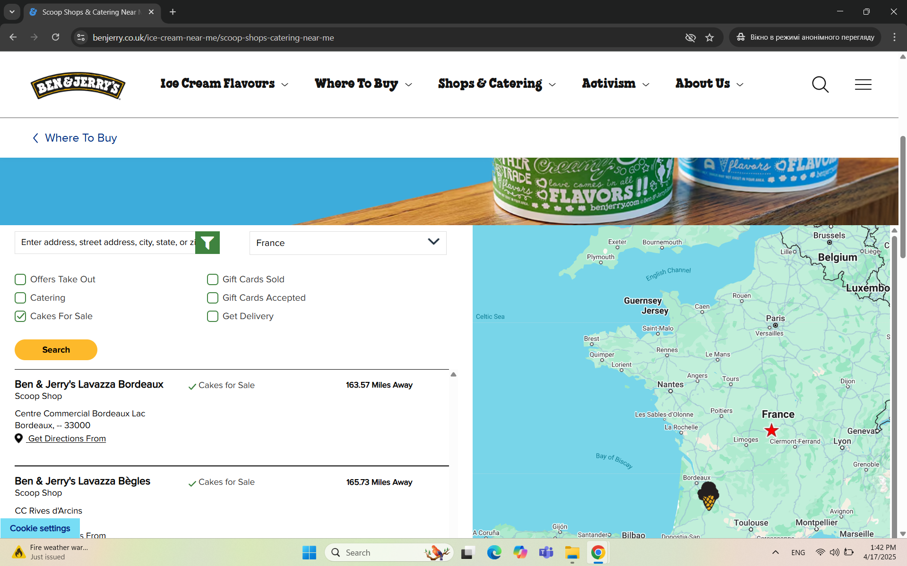

# [UC-04] - User Case: Filtering by Country and Product

**Date Tested:** 2025-04-08

**Feature Focus:** Product Filtering / Location Search

**Test Type:** Functional / Data Integrity

---

## Scenario Details

**Goal:** The user intends to find a Ben & Jerry's shop located in **France** that specifically sells cakes. The goal is to document the steps the user takes to search, filter by location, and verify product availability (cakes) at the selected store.

**Precondition:**
* The user is on the [Ben & Jerry’s UK Home Page](https://www.benjerry.co.uk/).
* The user's location services are disabled (to test manual selection)
* User's device is a desktop

## Steps

| Step # | Action |
| :--- | :--- |
| 1. | On the Home page, the user clicks on the **"Where to Buy"** section in the top navigation menu. |
| 2. | From the dropdown list, the user selects the **"Scoop Shops & Catering Near Me"** subsection. |
| 3. | On the **"Scoop Shops & Catering Near Me"** page, the user scrolls down to the location search fields. |
| 4. | The user taps on the **"Region"** dropdown field. |
| 5. | From the dropdown menu, the user selects **"France"**. |
| 6. | The user checks the **"Cakes for Sale"** checkbox located below the address search field. |
| 7. | The user clicks on the **"Search"** button. |
| 8. | The user reviews the search results. |

---

## Attachments
**Screenshots:**

